# **Taskify** 

**Taskify** is an app to manage your daily tasks and boost your productivity

# Video Introduction 📹

This is a small introduction video about Taskify  https://youtu.be/MEuoxix5SGY.

# Article ✍

To know more about how I build this project, read my [Article](https://vaibhav2002.hashnode.dev/taskify-an-app-to-manage-your-daily-tasks-and-boost-your-productivity-harperdb-hackathon)

# Application Install

***You can Install and test latest Taskify app from below 👇***

## Setup
Clone the repository on your machine. Open the project on your IDE and connect it to firebase and harperDB and everything will be setup

## About

 It uses firebase and HarperDB as it's backend. It uses Firebase Authentication for email based auth and Google auth, Firebase Crashlytics for crash reporting and HarperDB as its database.

- Fully functionable. 
- Clean and Simple Material UI.
- It supports dark theme too 🌗.

### Insights into the app 🔎

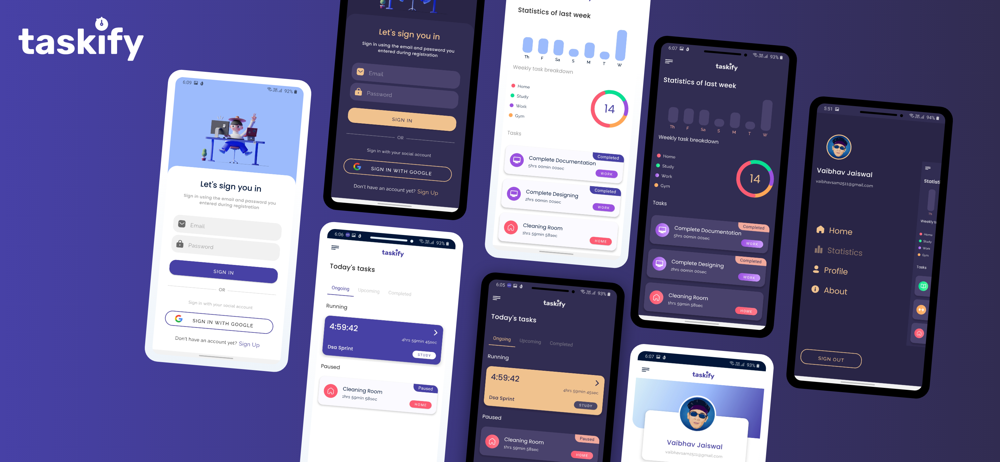

**Taskify** offers light as well as dark theme 🌓. So now you can use Taskify in whatever theme you like the most. 🔥

**Taskify** supports both email based and Social media authentication like Google authentication. Planning to add Facebook authentication too. 😁

Have a look at your running task, upcoming and completed tasks all in one place. Create a task by pressing the FAB below.

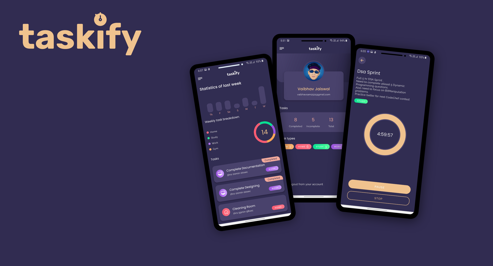

Taskify lets you start a timer ⌚ to track the time you take completing a task. Timer runs in background, so you dont need to keep the app open all the time. 👍 See stats 💪 of all tasks you created within the last week, including total tasks created in a day and breakdown of tasks based on category.

## 📸 Screenshots

||||
|:----------------------------------------:|:-----------------------------------------:|:-----------------------------------------: |
|  |  |  |
| 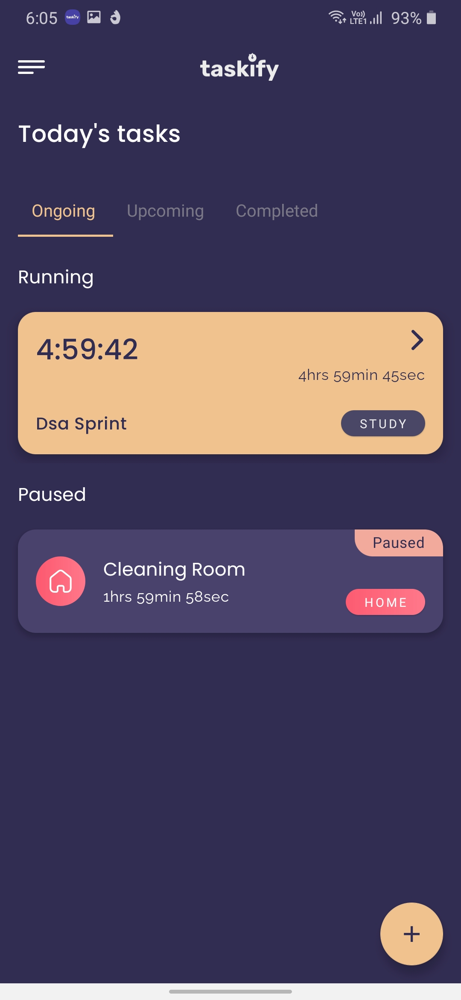  | 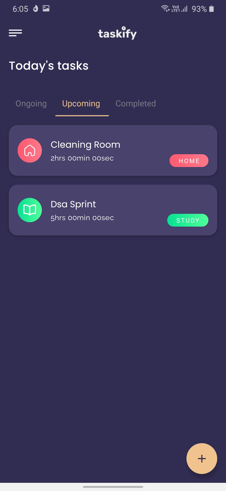 | 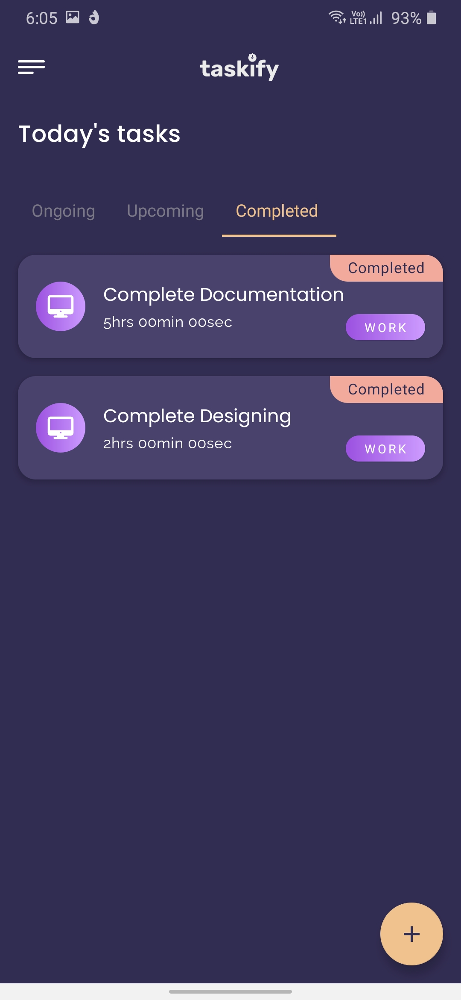    |
| 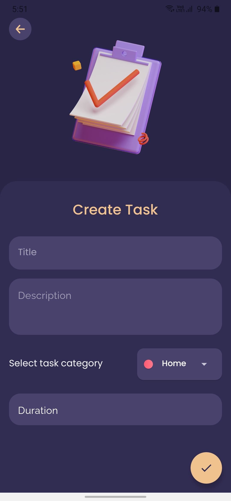 | 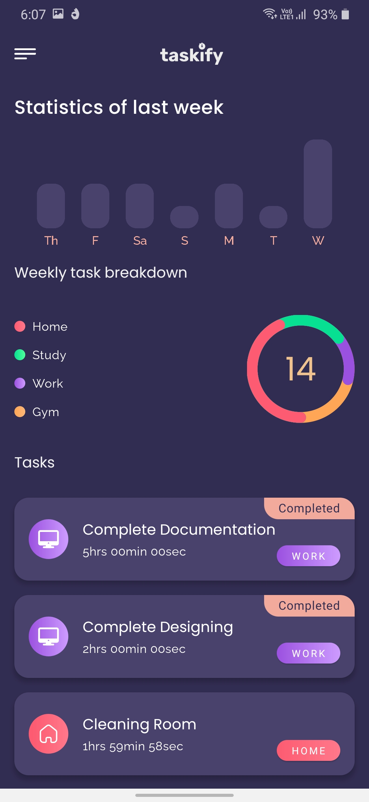    | 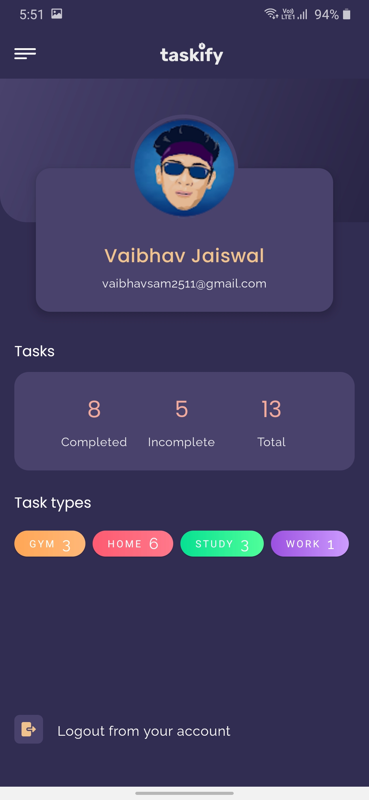      |
|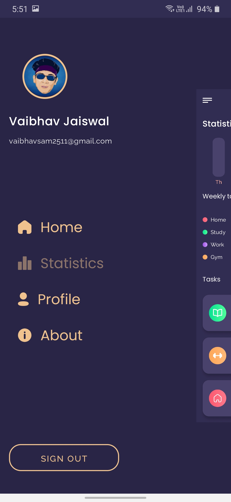  |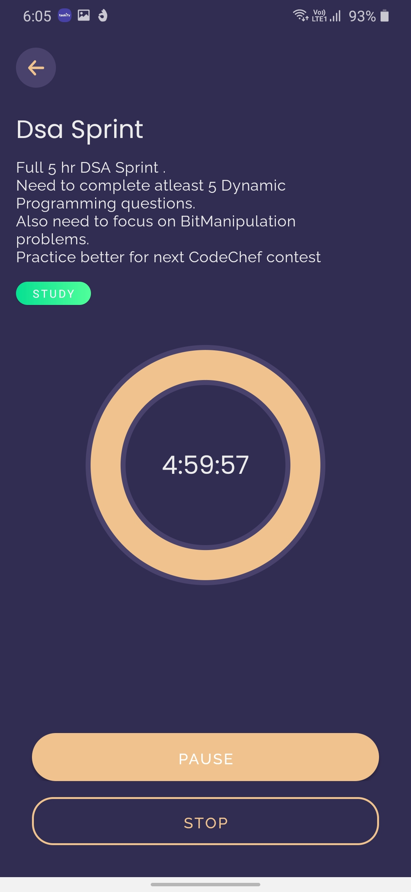  |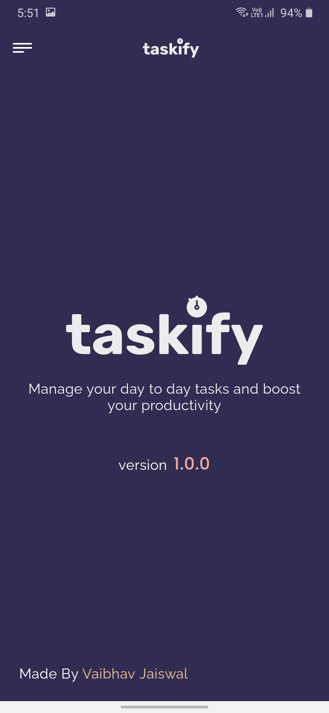      |

## Built With 🛠
- [Kotlin](https://kotlinlang.org/) - First class and official programming language for Android development.
- [Coroutines](https://kotlinlang.org/docs/reference/coroutines-overview.html) - For asynchronous and more..
- [Flow](https://kotlin.github.io/kotlinx.coroutines/kotlinx-coroutines-core/kotlinx.coroutines.flow/-flow/) - A cold asynchronous data stream that sequentially emits values and completes normally or with an exception.
 - [StateFlow](https://developer.android.com/kotlin/flow/stateflow-and-sharedflow) - StateFlow is a state-holder observable flow that emits the current and new state updates to its collectors.
- [Android Architecture Components](https://developer.android.com/topic/libraries/architecture) - Collection of libraries that help you design robust, testable, and maintainable apps.
  - [ViewModel](https://developer.android.com/topic/libraries/architecture/viewmodel) - Stores UI-related data that isn't destroyed on UI changes. 
  - [ViewBinding](https://developer.android.com/topic/libraries/view-binding) - Generates a binding class for each XML layout file present in that module and allows you to more easily write code that interacts with views.
  - [DataBinding](https://developer.android.com/topic/libraries/data-binding) - Binds data directly into XML layouts
  - [Room](https://developer.android.com/training/data-storage/room) - Room is an android library which is an ORM which wraps android's native SQLite database
  - [DataStore](https://developer.android.com/topic/libraries/architecture/datastore) - Jetpack DataStore is a data storage solution that allows you to store key-value pairs or typed objects with protocol buffers.
- [Dependency Injection](https://developer.android.com/training/dependency-injection) - 
  - [Hilt-Dagger](https://dagger.dev/hilt/) - Standard library to incorporate Dagger dependency injection into an Android application.
  - [Hilt-ViewModel](https://developer.android.com/training/dependency-injection/hilt-jetpack) - DI for injecting `ViewModel`.
- Backend
  - [Firebase](https://firebase.google.com)
    - Firebase Auth - To support email based authentication and google authentication
    - Firebase Crashlytics - To report app crashes
  - [HarperDB](https://harperdb.io) -  HarperDB is a geo-distributed database with hybrid SQL & NoSQL functionality in one powerful tool, accessed via a REST API.
- [Retrofit](https://square.github.io/retrofit/) - A type-safe HTTP client for Android and Java.
- [GSON](https://github.com/google/gson) - A modern JSON library for Kotlin and Java.
- [Timber](https://github.com/JakeWharton/timber) - A simple logging library for android.
- [GSON Converter](https://github.com/square/retrofit/tree/master/retrofit-converters/gson) - A Converter which uses Moshi for serialization to and from JSON.
- [Glide](https://github.com/bumptech/glide) - An image loading and caching library for Android focused on smooth scrolling
- [Coil](https://github.com/coil-kt/coil) - An image loading library for Android backed by Kotlin Coroutines.
- [Material Components for Android](https://github.com/material-components/material-components-android) - Modular and customizable Material Design UI components for Android.

# Package Structure
    
    com.vaibhav.taskify    # Root Package
    .
    ├── data                # For data handling.
    |   ├── local           # Room DB and its related classes
    |   ├── remote          # Firebase, HarperDB and their relative classes
    │   ├── model           # Model data classes, both remote and local entities
    │   └── repo            # Single source of data.
    |
    ├── di                  # Dependency Injection             
    │   └── module          # DI Modules
    |
    ├── ui                  # UI/View layer
    |   ├── adapters        # All Adapters, viewholder and diffUtils for recyclerViews      
    │   ├── auth            # Authorization Activity and its fragments
    │   ├── mainScreen      # Home Activity and its fragments
    |   ├── addTaskScreen   # Add Task Activity and its fragments
    |   ├── onBoarding      # OnboardingScreen
    │   └── splashScreen    # SplashScreen
    |
    ├── service             # Timer Service and its related classes
    |
    └── utils               # Utility Classes / Kotlin extensions

## Architecture
This app uses [***MVVM (Model View View-Model)***](https://developer.android.com/jetpack/docs/guide#recommended-app-arch) architecture.

  

---

## If you like my projects and want to support me to build more cool open source projects
  

---

 ## Contact
If you need any help, you can connect with me.

Visit:- [VaibhavJaiswal.io](https://vaibhav2002.github.io)
  

